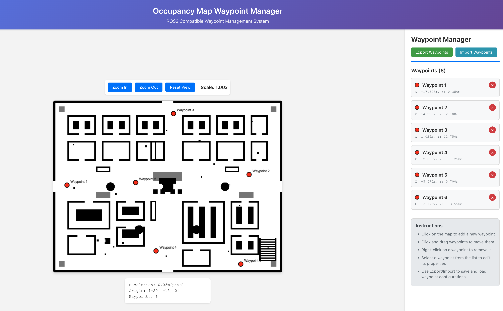

# Occupancy Map Waypoint Manager

A comprehensive React.js application for managing waypoints on ROS2 occupancy maps, designed specifically for robotic navigation systems. This tool allows you to visually place, edit, and manage navigation waypoints on your robot's occupancy grid maps.



## 🚀 Features

### Core Functionality
- **📍 Interactive Waypoint Management**: Click to add, drag to move, right-click to remove waypoints
- **🗺️ ROS2 Map Visualization**: Native support for PGM occupancy grids with YAML metadata
- **📐 Accurate Coordinate Conversion**: Automatic conversion between pixel and world coordinates
- **💾 Export/Import System**: Save and load waypoint configurations as JSON files
- **🎨 Visual Customization**: Change waypoint colors and names for better organization
- **🔍 Map Navigation**: Zoom in/out and pan functionality for detailed waypoint placement

### ROS2 Integration
- **📊 Occupancy Grid Support**: Direct compatibility with `nav_msgs/OccupancyGrid` format
- **🌐 World Coordinate System**: Proper transformation using map origin and resolution
- **🤖 Navigation Ready**: Export waypoints in ROS2 navigation stack compatible format
- **📡 Topic Integration**: Ready for `/map` topic subscription (with backend)

## 📋 Table of Contents

1. [Installation & Setup](#installation--setup)
2. [Usage Guide](#usage-guide)
3. [ROS2 Integration](#ros2-integration)
4. [Map Format Specification](#map-format-specification)
5. [API Documentation](#api-documentation)
6. [Development Guide](#development-guide)
7. [Troubleshooting](#troubleshooting)
8. [Advanced Features](#advanced-features)

## 🛠️ Installation & Setup

### Prerequisites

- **Node.js** (v14.0.0 or higher)
- **npm** or **yarn** package manager
- **Python 3.8+** (optional, for backend features)
- **ROS2** (Humble/Iron/Rolling) for robot integration

### Quick Start

1. **Clone or extract the project**:
```bash
cd xavier-waypoint-manager
```

2. **Install dependencies**:
```bash
npm install
```

3. **Start the development server**:
```bash
npm start
```

4. **Open your browser** to `http://localhost:3000`

### Optional Backend Setup

The Python backend provides additional features like persistent storage and ROS2 topic integration:

```bash
# Navigate to backend directory
cd backend

# Create virtual environment
python3 -m venv venv
source venv/bin/activate  # On Windows: venv\Scripts\activate

# Install dependencies
pip install -r requirements.txt

# Start Flask server
python app.py
```

Backend will be available at `http://localhost:5000`

## 📖 Usage Guide

### Basic Operations

#### Adding Waypoints
1. **Click anywhere** on the map to add a new waypoint
2. Waypoints appear as **red circles** with automatic numbering
3. Each waypoint shows its **world coordinates** in meters

#### Moving Waypoints
1. **Click and drag** any waypoint to reposition it
2. Coordinates update in **real-time** during movement
3. **Snap-to-grid** behavior for precise placement

#### Removing Waypoints
- **Right-click** on any waypoint to remove it instantly
- Or use the **× button** in the waypoint panel
- **Bulk removal** available through "Clear All" option

#### Editing Waypoint Properties
1. **Click on a waypoint** in the panel to select it
2. **Edit the name** in the text field
3. **Change the color** using the color picker
4. **Click "Update Waypoint"** to save changes

### Map Navigation

#### Zoom Controls
- **Zoom In**: Magnify the map for precise waypoint placement
- **Zoom Out**: Get a broader view of the environment
- **Reset View**: Return to original scale and position
- **Current scale** displayed in real-time

#### Coordinate System
- **Origin**: Bottom-left corner of the map
- **Units**: Meters (based on map resolution)
- **Coordinate Display**: Real-time X,Y position in world frame

### Data Management

#### Exporting Waypoints
1. Click **"Export Waypoints"** button
2. Downloads a **JSON file** with timestamp
3. Contains waypoint data and metadata
4. **ROS2 compatible format** for navigation stack

#### Importing Waypoints
1. Click **"Import Waypoints"** button
2. Select a previously exported JSON file
3. Waypoints are **automatically loaded** and displayed
4. **Validation** ensures data integrity

## 🤖 ROS2 Integration

### Map Topic Integration

#### Getting Maps from ROS2
To use your robot's actual occupancy map:

1. **Save the map** from your ROS2 system:
```bash
# In your ROS2 workspace
ros2 run nav2_map_server map_saver_cli -f my_robot_map
```

2. **Copy the files** to the application:
```bash
# Copy to public directory
cp my_robot_map.pgm xavier-waypoint-manager/public/sample-map.pgm
cp my_robot_map.yaml xavier-waypoint-manager/public/sample-map.yaml
```

3. **Restart the application** to load your map

#### Real-time Map Updates (Backend Required)
For live map updates from `/map` topic:

```python
# Add to backend/app.py
import rclpy
from nav_msgs.msg import OccupancyGrid

class MapSubscriber:
    def __init__(self):
        rclpy.init()
        self.node = rclpy.create_node('waypoint_manager')
        self.subscription = self.node.create_subscription(
            OccupancyGrid,
            '/map',
            self.map_callback,
            10
        )
    
    def map_callback(self, msg):
        # Process occupancy grid
        # Update map visualization
        pass
```

### Navigation Stack Integration

#### Waypoint Format for Nav2
The application exports waypoints in Nav2 compatible format:

```json
{
  "waypoints": [
    {
      "header": {
        "frame_id": "map",
        "stamp": {"sec": 0, "nanosec": 0}
      },
      "pose": {
        "position": {"x": 1.5, "y": 2.0, "z": 0.0},
        "orientation": {"x": 0.0, "y": 0.0, "z": 0.0, "w": 1.0}
      },
      "name": "Kitchen",
      "id": 1234567890
    }
  ]
}
```

#### Using Waypoints in ROS2 Navigation

1. **Export waypoints** from the application
2. **Load in your ROS2 node**:

```python
import json
from geometry_msgs.msg import PoseStamped

def load_waypoints(filename):
    with open(filename, 'r') as f:
        data = json.load(f)
    
    waypoints = []
    for wp in data['waypoints']:
        pose = PoseStamped()
        pose.header.frame_id = wp['header']['frame_id']
        pose.pose.position.x = wp['pose']['position']['x']
        pose.pose.position.y = wp['pose']['position']['y']
        pose.pose.orientation.w = wp['pose']['orientation']['w']
        waypoints.append(pose)
    
    return waypoints
```

3. **Send to navigation stack**:

```python
from nav2_simple_commander.robot_navigator import BasicNavigator

navigator = BasicNavigator()
waypoints = load_waypoints('exported_waypoints.json')

# Navigate through waypoints
navigator.followWaypoints(waypoints)
```

### SLAM Integration

#### Using with SLAM Toolbox
1. **Run SLAM** to generate your map:
```bash
ros2 launch slam_toolbox online_async_launch.py
```

2. **Save the map** when satisfied:
```bash
ros2 service call /slam_toolbox/save_map slam_toolbox/srv/SaveMap "name: 'my_map'"
```

3. **Use the saved map** in the waypoint manager

#### Dynamic Map Updates
For maps that change during operation:

```python
# Subscribe to map updates
self.map_sub = self.node.create_subscription(
    OccupancyGrid,
    '/map',
    self.update_map_callback,
    qos_profile=qos_profile_sensor_data
)
```

## 🗺️ Map Format Specification

### PGM File Format
The application uses standard PGM (Portable Gray Map) format:

- **Header**: P5 (binary) or P2 (ASCII)
- **Dimensions**: Width and height in pixels
- **Max value**: 255 (8-bit grayscale)
- **Data values**:
  - `0`: Occupied space (black)
  - `255`: Free space (white)
  - `128`: Unknown space (gray)

### YAML Metadata Format
Companion YAML file contains map parameters:

```yaml
image: sample-map.pgm           # PGM filename
resolution: 0.050000            # meters/pixel
origin: [-10.000000, -10.000000, 0.000000]  # [x, y, theta]
negate: 0                       # 0=normal, 1=inverted
occupied_thresh: 0.65           # Occupancy threshold
free_thresh: 0.196              # Free space threshold
```

### Coordinate Transformation
The application performs coordinate conversion:

```javascript
// Pixel to World coordinates
worldX = origin[0] + (pixelX * resolution)
worldY = origin[1] + ((height - pixelY) * resolution)  // Y-axis flip

// World to Pixel coordinates
pixelX = (worldX - origin[0]) / resolution
pixelY = height - ((worldY - origin[1]) / resolution)
```

## 📡 API Documentation

### REST Endpoints (Backend)

#### Waypoint Management
- `GET /api/waypoints` - Retrieve all waypoints
- `POST /api/waypoints` - Add new waypoint
- `PUT /api/waypoints/<id>` - Update waypoint
- `DELETE /api/waypoints/<id>` - Remove waypoint
- `DELETE /api/waypoints/clear` - Clear all waypoints

#### Map Operations
- `GET /api/map/metadata` - Get map metadata
- `GET /api/waypoints/export` - Export in ROS2 format

#### System
- `GET /api/health` - Health check

### Request/Response Examples

#### Add Waypoint
```bash
curl -X POST http://localhost:5000/api/waypoints \
  -H "Content-Type: application/json" \
  -d '{
    "name": "Kitchen",
    "x": 2.5,
    "y": 1.8,
    "color": "#ff0000"
  }'
```

#### Export Waypoints
```bash
curl http://localhost:5000/api/waypoints/export
```

## 🔧 Development Guide

### Project Structure

```
xavier-waypoint-manager/
├── public/                     # Static assets
│   ├── sample-map.pgm         # Sample occupancy grid
│   ├── sample-map.yaml        # Map metadata
│   └── index.html             # HTML template
├── src/                       # React source code
│   ├── components/            # React components
│   │   ├── MapViewer.js       # Main map component
│   │   ├── MapViewer.css      # Map styling
│   │   ├── WaypointPanel.js   # Waypoint management
│   │   └── WaypointPanel.css  # Panel styling
│   ├── App.js                 # Main application
│   ├── App.css                # Global styles
│   └── index.js               # Entry point
├── backend/                   # Python backend (optional)
│   ├── app.py                 # Flask application
│   └── requirements.txt       # Python dependencies
├── generate_sample_map.py     # Map generation script
└── README.md                  # This file
```

### Key Components

#### MapViewer Component
- **Canvas-based rendering** for performance
- **Mouse event handling** for interactions
- **Coordinate transformations** between pixel/world
- **Zoom and pan functionality**

#### WaypointPanel Component
- **Waypoint list management**
- **Property editing interface**
- **Export/import functionality**
- **Real-time coordinate display**

### Adding New Features

#### Custom Waypoint Types
```javascript
const waypointTypes = {
  NAVIGATION: { color: '#ff0000', icon: '📍' },
  CHARGING: { color: '#00ff00', icon: '🔋' },
  PICKUP: { color: '#0000ff', icon: '📦' }
};
```

#### Path Visualization
```javascript
const drawPath = (ctx, waypoints) => {
  ctx.beginPath();
  ctx.strokeStyle = '#ff00ff';
  ctx.lineWidth = 2;
  
  waypoints.forEach((wp, index) => {
    const pixel = worldToPixel(wp.x, wp.y);
    if (index === 0) {
      ctx.moveTo(pixel.x, pixel.y);
    } else {
      ctx.lineTo(pixel.x, pixel.y);
    }
  });
  
  ctx.stroke();
};
```

### Testing

#### Unit Tests
```bash
# Run React tests
npm test

# Run with coverage
npm test -- --coverage
```

#### Integration Tests
```bash
# Test backend API
cd backend
python -m pytest tests/
```

## 🐛 Troubleshooting

### Common Issues

#### Map Not Loading
**Problem**: Map appears blank or doesn't load
**Solutions**:
- Check that `sample-map.pgm` and `sample-map.yaml` exist in `public/`
- Verify YAML syntax and file paths
- Check browser console for errors
- Ensure map dimensions match YAML metadata

#### Incorrect Coordinates
**Problem**: Waypoints appear in wrong locations
**Solutions**:
- Verify `origin` values in YAML file
- Check `resolution` parameter
- Ensure Y-axis orientation matches your robot's frame
- Test with known reference points

#### Export/Import Issues
**Problem**: Waypoint files don't save or load properly
**Solutions**:
- Check browser download permissions
- Verify JSON file format
- Ensure file isn't corrupted
- Try with smaller waypoint sets

#### Performance Issues
**Problem**: Application runs slowly with many waypoints
**Solutions**:
- Limit waypoints to reasonable number (<100)
- Optimize canvas rendering
- Use waypoint clustering for large datasets
- Consider backend storage for large projects

### Debug Mode

Enable debug logging:
```javascript
// In MapViewer.js
const DEBUG = true;

const debugLog = (message, data) => {
  if (DEBUG) {
    console.log(`[MapViewer] ${message}`, data);
  }
};
```

### Browser Compatibility

**Supported Browsers**:
- Chrome 80+
- Firefox 75+
- Safari 13+
- Edge 80+

**Required Features**:
- Canvas 2D API
- File API
- ES6 modules

## 🚀 Advanced Features

### Multi-Robot Support

#### Robot-Specific Waypoints
```javascript
const robotWaypoints = {
  'robot_1': [
    { name: 'Station A', x: 1.0, y: 2.0, color: '#ff0000' }
  ],
  'robot_2': [
    { name: 'Station B', x: 3.0, y: 4.0, color: '#00ff00' }
  ]
};
```

#### Fleet Management
```javascript
const fleetManager = {
  assignWaypoint: (robotId, waypointId) => {
    // Assign waypoint to specific robot
  },
  getAvailableRobots: () => {
    // Return list of available robots
  }
};
```

### Path Planning Integration

#### A* Path Planning
```javascript
const planPath = (start, goal, occupancyGrid) => {
  // Implement A* algorithm
  // Return array of intermediate waypoints
};
```

#### ROS2 Path Planning
```python
# Integration with Nav2 planner
from nav2_msgs.action import ComputePathToPose

def plan_path_to_waypoint(waypoint):
    goal_msg = ComputePathToPose.Goal()
    goal_msg.goal.header.frame_id = 'map'
    goal_msg.goal.pose.position.x = waypoint['x']
    goal_msg.goal.pose.position.y = waypoint['y']
    
    # Send to planner
    return planner_client.send_goal_async(goal_msg)
```

### Real-time Monitoring

#### Robot Position Tracking
```javascript
const trackRobotPosition = (robotId) => {
  // Subscribe to robot pose
  // Update visualization
};
```

#### Waypoint Status Updates
```javascript
const waypointStatus = {
  PENDING: 'pending',
  IN_PROGRESS: 'in_progress',
  COMPLETED: 'completed',
  FAILED: 'failed'
};
```

## 📄 License

This project is licensed under the MIT License - see the [LICENSE](LICENSE) file for details.

## 🤝 Contributing

1. Fork the repository
2. Create a feature branch (`git checkout -b feature/amazing-feature`)
3. Commit your changes (`git commit -m 'Add amazing feature'`)
4. Push to the branch (`git push origin feature/amazing-feature`)
5. Open a Pull Request

## 📞 Support

- **Issues**: [GitHub Issues](https://github.com/your-repo/issues)
- **Discussions**: [GitHub Discussions](https://github.com/your-repo/discussions)
- **Email**: support@your-domain.com

## 🙏 Acknowledgments

- **ROS2 Community** for the navigation stack
- **React Team** for the excellent framework
- **Nav2 Contributors** for navigation tools
- **SLAM Toolbox** for mapping capabilities

---

**Happy Robot Navigation! 🤖🗺️**
